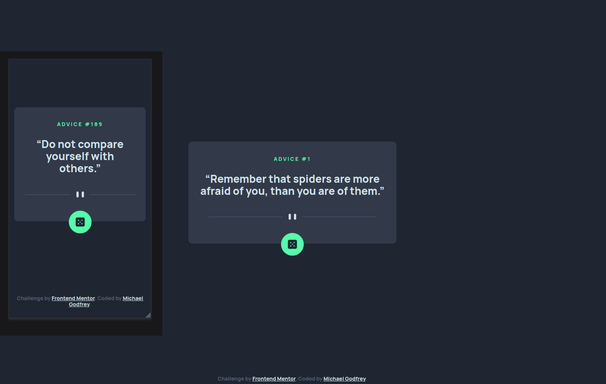

# Frontend Mentor - Advice generator app solution

This is a solution to the [Advice generator app challenge on Frontend Mentor](https://www.frontendmentor.io/challenges/advice-generator-app-QdUG-13db). Frontend Mentor challenges help you improve your coding skills by building realistic projects.

## Table of contents

- [Overview](#overview)
  - [The challenge](#the-challenge)
  - [Screenshot](#screenshot)
  - [Links](#links)
- [My process](#my-process)
  - [Built with](#built-with)
  - [What I learned](#what-i-learned)
  - [Continued development](#continued-development)
  - [Useful resources](#useful-resources)
- [Author](#author)

## Overview
Hello, thank you for visiting this repository. I completed this challenge to practice using fetch to get data from an API and displaying that data.

### The challenge

Users should be able to:

- View the optimal layout for the app depending on their device's screen size
- See hover states for all interactive elements on the page
- Generate a new piece of advice by clicking the dice icon

### Screenshot



### Links

- Solution URL: [Frontend Mentor Solution Page](https://your-solution-url.com)
- Live Site URL: [Live Page on GitHub pages](https://https://michagodfrey.github.io/advice-generator)

## My process

### Built with

- Semantic HTML5 markup
- CSS custom properties
- Mobile-first workflow
- JavaScript
- Advice Slip JSON  API

### What I learned

This was the first time I completed a project using fetch and a third party API without direct guidance from a tutorial. I'm unsure they way I've made this is best practice. The button just reloads the page.

```html
<button type="button" class="card__button" onClick="window.location.reload(true)">
```  

Below is the way I used fetch to get the data from Advice Slip JSON API when the page loads. One subtle detail in the design was the style of the quotation marks was not the standard text. I solved this with the character entities either side of the advice.

```js
const id = document.getElementById("id");
const advice = document.getElementById("advice");

fetch('https://api.adviceslip.com/advice')
  .then(response => response.json())
  .then(adviceData => {
    const adviceSlip = adviceData.slip;
    id.innerHTML = `Advice #${adviceSlip.id}`;
    advice.innerHTML = `&ldquo;${adviceSlip.advice}&rdquo;`;
  }).catch(error => {
    console.log(error);
    id.innerHTML = `Error`;
    advice.innerHTML = `Sorry. Something went wrong :(`;
  });
```

### Continued development

I will continue to complete projects that involve retrieving data from third parties.

### Useful resources

- [Youtube video by Oston Code Cypher](https://www.youtube.com/watch?v=2AfzKmgqWUE&ab_channel=OstonCodeCypher) - While I didn't use the exact same method to it was watching this video that helped me figure out how to complete this challenge.
- [CSS Code Generator](https://html-css-js.com/css/generator/) - This webpage is a great resource to generate custom effects. The glow effect was created from code generated from this site.

## Author

- Website - [My showcase page](https://michagodfrey.github.io/)
- Frontend Mentor - [@michagodfrey](https://www.frontendmentor.io/profile/michagodfrey)
- Twitter - [@Michael07865192](https://twitter.com/Michael07865192)
